<a id="T_EF876BD9"></a>

# "Generating Tests for Your MATLAB Code" Workshop Guide

This workshop provides a step\-by\-step guide to generating automated tests using the MATLAB Unit Test Framework and MATLAB Test.

In this workshop, you will:

- fork and modify your own copy of the MathWorks [Generating Tests for Your MATLAB Code Workshop](https://github.com/mathworks/Generating-Tests-for-Your-MATLAB-Code-Workshop) repository on GitHub
- generate tests using your command history and MATLAB Copilot
- automatically find and run existing tests
- explore code coverage metrics for your tested code
- identify a bug based on testing and code coverage
- automate your testing using continuous integration (CI) practices with GitHub Actions and build tool

*Note:*  Some of the file links may not work in the PDF version of this document, but they work work in the WorkshopGuide.m file in MATLAB.

<!-- Begin Toc -->

## Table of Contents
&#8195;[Workshop Requirements](#H_34C2FB57)
 
&#8195;[Part 1:  Getting the workshop files and configuring GitHub for automated testing and results publishing](#TMP_0d8f)
 
&#8195;[Part 2:  Generating your first tests](#TMP_7f37)
 
&#8195;[Part 3:  Finding existing tests, measuring coverage, and catching bugs](#TMP_0186)
 
&#8195;[Part 4:  Updating badges, committing our changes, and pushing to GitHub](#TMP_043f)
 
&#8195;[Part 5:  Watch GitHub Actions automatically test your changes and publish results](#TMP_0688)
 
&#8195;[Workshop wrap\-up and additional information](#TMP_7711)
 
&#8195;[Homework:  Hands\-on experience with property\-based testing](#TMP_536c)
 
<!-- End Toc -->

<a id="H_34C2FB57"></a>

# Workshop Requirements

The following steps cover all of the things you will need to successfully complete the workshop:

**A)  Access to MATLAB Online or a desktop MATLAB with the MATLAB Test*****™*** **product**

<a id="H_D43A4973"></a>
- Go to:  [**https://matlab.mathworks.com**](https://matlab.mathworks.com/)
- *Note:*  If you do not have a MathWorks account, the above link will ask you to create an account for free

**B)  Access to MATLAB Online or a desktop MATLAB with MATLAB Copilot**

- *Note:*  If you do not have a license for MATLAB Copilot, you can simply skip that part of the workshop

**C)  A GitHub account**

- The workshop leverages the free repository and CI capabilities offered by GitHub and GitHub Actions
- Go to:  [**https://github.com/signup**](https://github.com/signup)

<a id="TMP_0d8f"></a>

# Part 1:  Getting the workshop files and configuring GitHub for automated testing and results publishing

In this section, you will:

1. Fork the workshop files to your personal GitHub account
2. Enable GitHub Actions for automated testing
3. Enable GitHub Pages for report publishing
4. Open the workshop in MATLAB Online

*Note:*  You can also clone your forked copy of the repository to your desktop and use a desktop MATLAB

<a id="TMP_35a2"></a>
**Part 1.1:  Fork the "Generating Tests for Your MATLAB Code Workshop" repository to your GitHub Account**

First, you'll start by forking the "[Generating Tests for Your MATLAB Code Workshop](https://github.com/mathworks/Generating-Tests-for-Your-MATLAB-Code-Workshop)" repository to our own GitHub account.

**Wait... What does it mean to "fork a repository" and why should I do it?**

Forking a repository allows you to freely experiment with and push changes to a project without affecting the original project.

GitHub provides some great information about "why" and "how" to fork a repository here: [https://docs.github.com/en/enterprise\-cloud@latest/pull\-requests/collaborating\-with\-pull\-requests/working\-with\-forks/fork\-a\-repo](https://docs.github.com/en/enterprise-cloud@latest/pull-requests/collaborating-with-pull-requests/working-with-forks/fork-a-repo)

Let's get started!

**Go to:** [**https://github.com/mathworks/Generating\-Tests\-for\-Your\-MATLAB\-Code\-Workshop**](https://github.com/mathworks/Generating-Tests-for-Your-MATLAB-Code-Workshop)

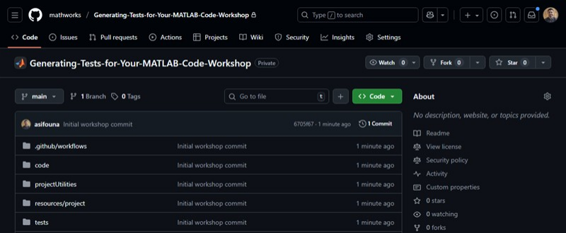

<a id="H_4B8B9F5D"></a>
**Press the "Fork" button (top right)**

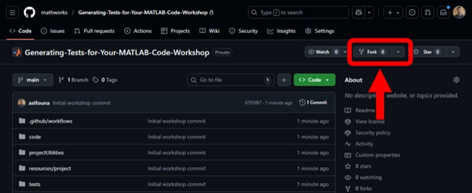

<a id="H_DB2C80D4"></a>
**Create your fork**

GitHub offers the ability to rename your copy of the repository, but this guide will assume the default name.

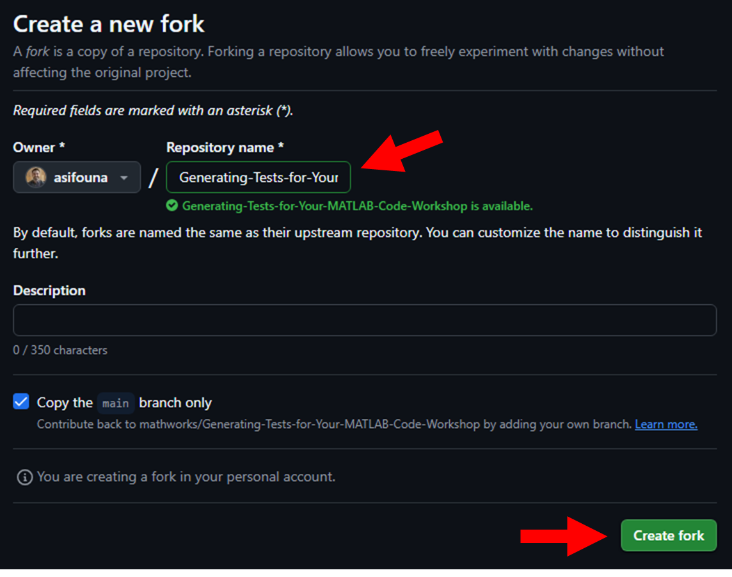

***Notes:***

- You may need to log into your GitHub account again during this step
- There's no problem with renaming your copy of the repository, but the rest of the workshop guide and screenshots assume the default repository name

**Once you've forked the repository, you should see:**

- your GitHub username at the top of your repository
- "forked from mathworks/Generating\-Tests\-for\-Your\-MATLAB\-Code\-Workshop"

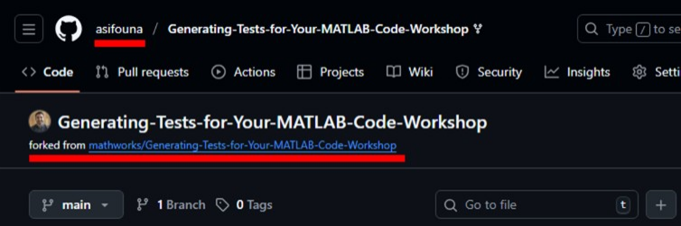

Before you go to MATLAB Online, let's enable some useful GitHub features that will be automatically triggered when we push our changes to GitHub later.

<a id="TMP_8dc4"></a>
**Part 1.2:  Enable GitHub Actions**

GitHub offers built\-in continuous integration (CI) services via their "GitHub Actions" feature. By default, GitHub Actions is disabled for forked repositories that contain a GitHub Actions YAML file, so you'll have to enable Actions before you can use them for the workshop. The workshop already provides a GitHub Actions YAML file to automatically test your code and publish test results so you can see them directly from your repository every time you push your code.

**Select the "Actions" tab**

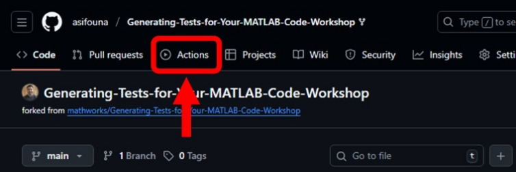

**Click the "I understand my workflows, go ahead and enable them" button**

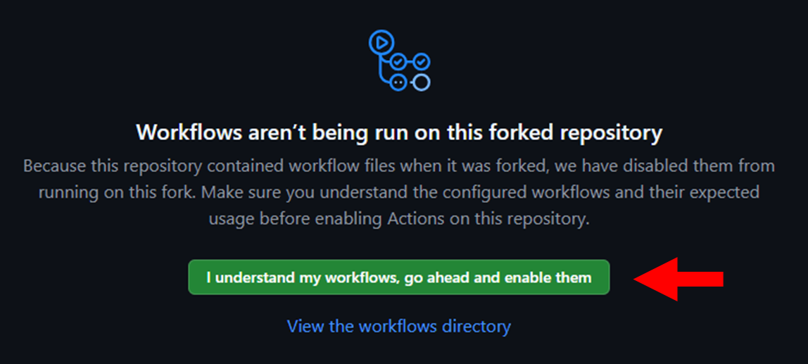

And that's it! GitHub Actions is now enabled for your repository.

<a id="TMP_2b25"></a>
**Part 1.3:  Enable GitHub Pages to publish our test results**

GitHub offers a built\-in way to publish test reports and artifacts created from your CI jobs. By default, GitHub Pages is disabled for new repositories, so we'll have to enable GitHub Pages before we can publish our test reports.

**Select the "Settings" tab**

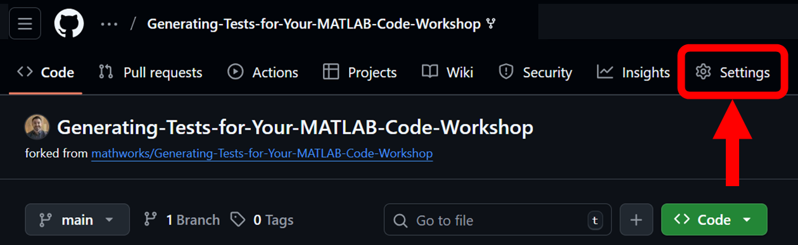

**Select the "Pages" entry on the left\-side navigation panel**


**Change the "Build and deployment > Source" dropdown and select "GitHub Actions"**

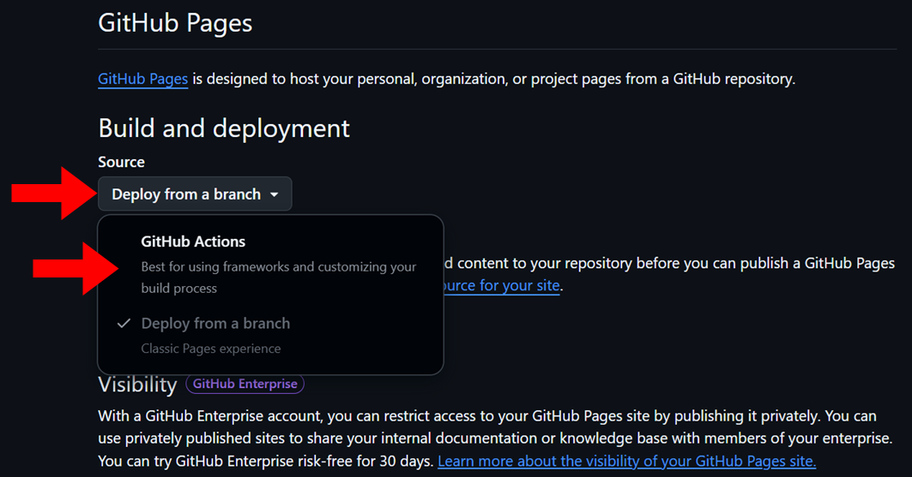

GitHub Pages is now enabled and your GitHub Actions will be allowed to publish test results for everyone to see.

<a id="TMP_1ab2"></a>
**Part 1.4:  Open the workshop in MATLAB Online**

*Notes:* 

- You may also do this workshop using a desktop MATLAB with the MATLAB Test product installed.
- If you do not have the MATLAB Test product, you will not see the right\-click menu items and buttons described below

Let's get started!

**Go to:** [**https://matlab.mathworks.com**](https://matlab.mathworks.com)

- *Note:*  If you do not have a MathWorks account, you will need to create one before continuing.

<a id="H_4B8B9F5D"></a>
**Get the workshop files selecting Home > New > Git Clone**

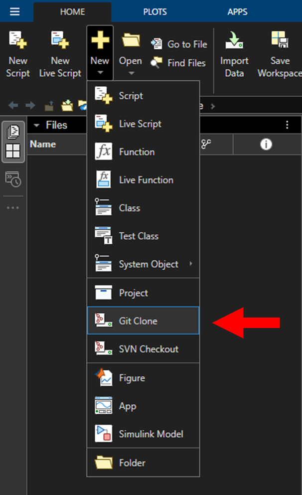

<a id="H_DB2C80D4"></a>
**Enter the URL of your GitHub repository in the dialog and hit "Clone"**

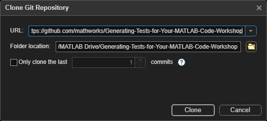

 

**Open the workshop project by double\-clicking on the** [**`WorkshopProject.prj`**](./WorkshopProject.prj) **file**

A MATLAB project is a useful tool that makes it easy to:

- automatically set up your path consistently across multiple users and machines
- run startup and shutdown scripts when you open or close the project
- keep one project from affecting the environment of another project

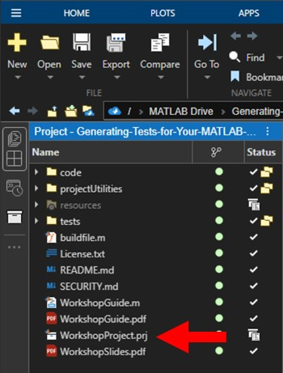

**Give MATLAB permission to run project startup tasks**

As part of our commitment to security, MATLAB will ask you for permission before executing any code during project startup the first time you open a project.

For this workshop, the code we are executing during project startup is to automatically open the workshop guide ([`WorkshopGuide.m`](./WorkshopGuide.m)) for you when you open the project.

In the following dialog, please select "Open" to open the project and run this startup task.

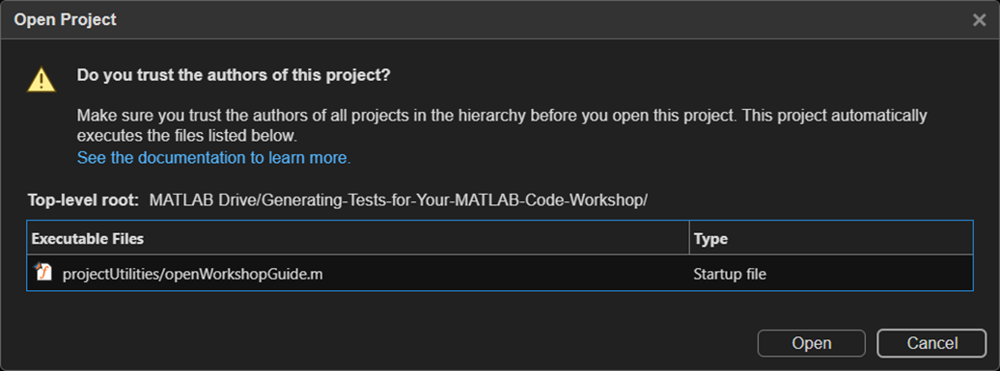

Your MATLAB now should look something like this:

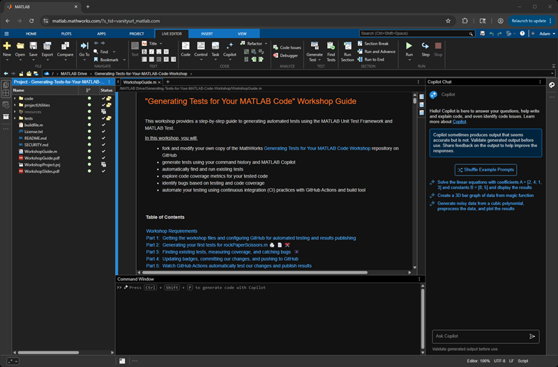

*Notes:* 

- You can enable Dark Mode by going to Home > Settings > MATLAB > Appearance and selecting "Dark" as the desktop theme (shown below)
- You will not see the "Copilot Chat" panel on the right if you do not have access to MATLAB Copilot

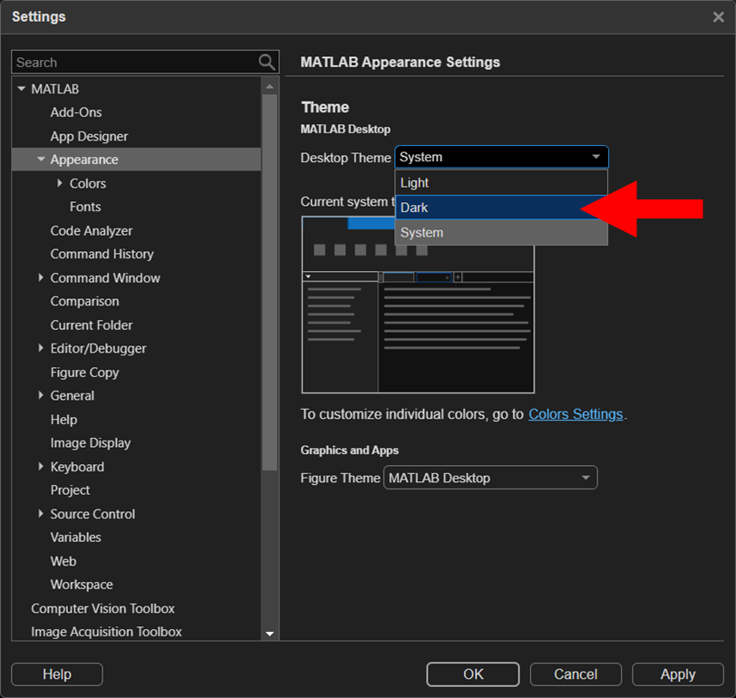

Now you're ready to start generating tests!

<a id="TMP_7f37"></a>

# Part 2:  Generating your first tests

In this section, you will:

1. Generate tests using your command history
2. Generate tests using MATLAB Copilot
3. Add generated tests to your project

<a id="TMP_684d"></a>
**Part 2.1: Generating your first test using Command History**

For this workshop, we are going to use the [`rockPaperScissors.m`](./code/rockPaperScissors.m) function that emulates playing the game "rock, paper, scissors" as a starting point.

- *Note*: If you're unfamiliar with "rock, paper, scissors" (also known as "rock, scissors, paper"), you can learn more about the game here: [https://en.wikipedia.org/wiki/Rock\_paper\_scissors](https://en.wikipedia.org/wiki/Rock_paper_scissors)

**Open the** [**`rockPaperScissors`**](./code/rockPaperScissors.m) **function (found in the code folder)**

```matlab
edit rockPaperScissors.m
```

*Note:*  The [**`rockPaperScissors`**](./code/rockPaperScissors.m) function can also be found in the `code` folder

**Interactively test** [**`rockPaperScissors.m`**](./code/rockPaperScissors.m) **by playing rock, paper, scissors using the MATLAB Command Window**

Here's an example code you can run at the Command Window:

```
>> player1Choice = "rock";
>> player2Choice = "scissors";
>> result = rockPaperScissors(player1Choice,player2Choice)
```
```
result = 
    "Player 1 wins"
```

Feel free to try other inputs to see which player wins.

**Generate your first test for the** [**`rockPaperScissors`**](./code/rockPaperScissors.m) **function using our command history**

While we could start creating a test from scratch, wouldn't it be nice if we could reuse the interactive testing we did at the Command Window?

As of MATLAB R2025a, MATLAB Test introduced a feature to generate a test from your command history.

**Go to the Command History panel**

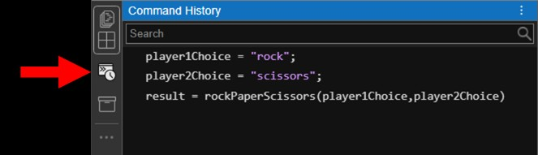

*Note:*  If you don't see the Command History panel icon, you can add the icon by selecting the "`...`" option and selecting the "Command History" item.

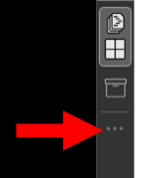

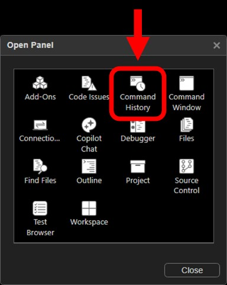

*Note:*  You can also access your command history by pressing the "up" key while at the MATLAB Command Window.

**Right\-Click one of your calls to** **`rockPaperScissors`** **and select "Generate Test"**

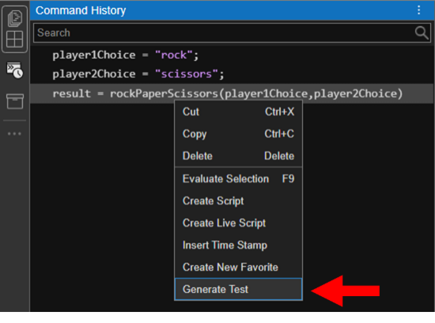

This will automatically gather all relevant code lines needed to execute that command successfully and generate a test for you. All you need to do is add in your expected output.

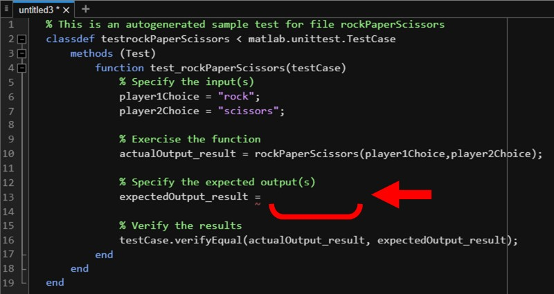

**Add in your expected output**

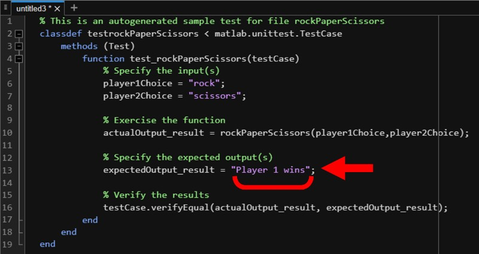

**Save your test to the** **`tests`** **folder**

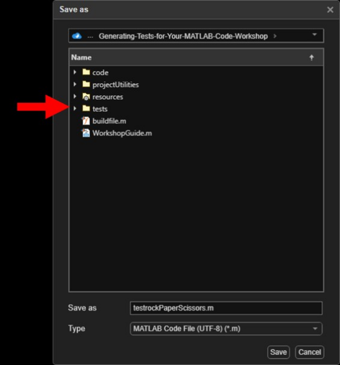

**Run your test using the "Run Tests" button in the Editor toolstrip**


As of MATLAB R2023a, running tests from the Editor toolstrip will automatically open the MATLAB Test Browser.

The MATLAB Test Browser makes it easy to:

- rerun tests without being in the test file
- explore test failure diagnostics
- filter results based on test status (pass, fail, incomplete)
- enable code coverage
- enable parallel test execution

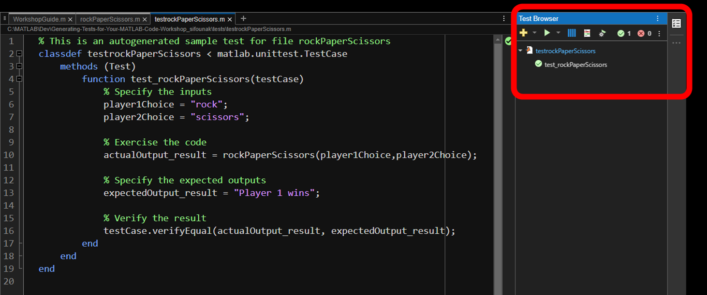

*Note:*  If you do not see the Test Browser appear, it may be that the right\-side panel is collapsed and you need to click on the Test Browser icon to expand the right\-side panel.


After your tests are done running, you will be able to to quickly see that your tests have passed. Yay!

<a id="TMP_9172"></a>
**Part 2.2:  Generate tests using MATLAB Copilot**

As of MATLAB R2025a, MATLAB now offers MATLAB Copilot (requires a separate license) that enables GenAI capabilities optimized for MATLAB code. As with most platforms, we have a MATLAB Copilot chat panel to use AI in a conversational way.

To make testing even easier, MATLAB Test enables 1\-click buttons to automatically generate tests for the code you are looking at.

*Note:* Only the "Generate test for the current file using Copilot" option uses MATLAB Copilot. All other test generation options do not use any LLM technology and create tests using templates and static code analysis.

**Go back to** [**`rockPaperScissors.m`**](./code/rockPaperScissors.m)

```matlab
edit rockPaperScissors.m
```

**In the Editor toolstrip, expand the "Generate Test" drop down menu and select "Generate test for the current file using MATLAB Copilot"**

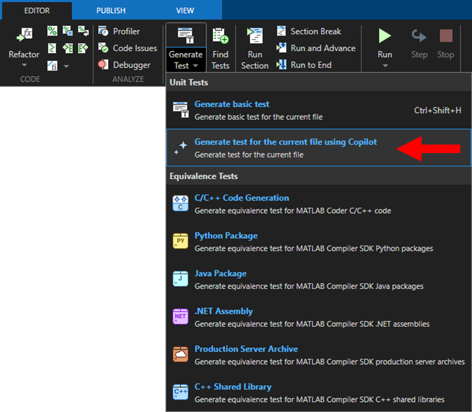

MATLAB Copilot will generate multiple ready\-to\-run tests.

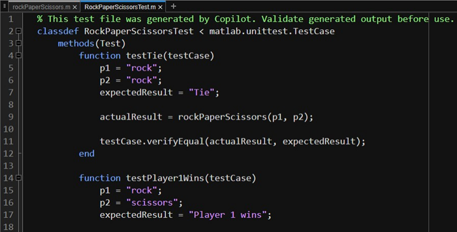

*Note:*  As with all LLM\-based technologies, remember to validate the output before using it in production systems.

**Save and run your generated tests**

Just like before, save your new tests to the `tests` folder and run your tests.

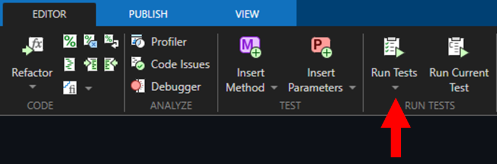

 **Look at your test results in the MATLAB Test Browser**

- *Note:*  Depending on the tests MATLAB Copilot generates, you may or may not end up with some failing tests.

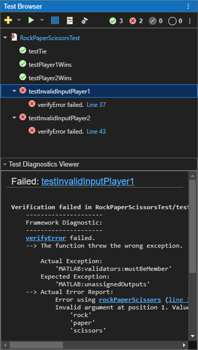

For the sake of time in this workshop, let's simply comment out or remove any failing tests from the test file and rerun the tests to ensure all remaining tests pass.

*Note on generated test failures:*

- In the screenshot above, MATLAB Copilot generated two failing tests where it intentionally provided invalid inputs to the [**`rockPaperScissors`**](./code/rockPaperScissors.m) function to ensure the function would error in the expected way. This practice is called "negative testing." However, in this case, the tests failed because MATLAB Copilot was expecting the incorrect error message compared to the error the function gave. To fix this, we can simply put in the right error message for the test to check or remove these two tests completely if we don't find them very useful at this time. In either case, this reinforces the fact that we should always validate the output of LLMs.

<a id="TMP_22e2"></a>
**Part 2.3:  Add generated tests to your project**

When you create a new file directly from the Project side panel, the file is automatically added to the project and to source control.

However, when you create a new file in another way (e.g., "New > Function," the "+" button on the Editor's tab toolbar, or the test generation options), MATLAB leaves it up to you to decide whether or not to include the file in your project.

Let's add our 2 new test files to the project

**Find your new test files in the** **`tests`** **folder using the Project side panel**

Go back to the Project side panel.

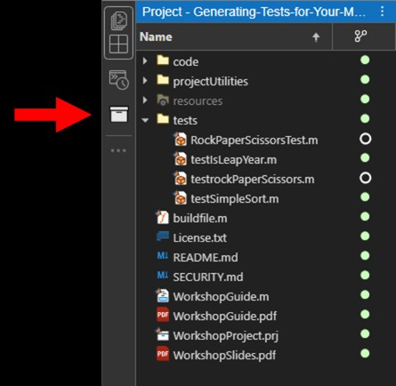

You can identify files not in your project when the Status column is not a check mark or the Git column is an empty circle.

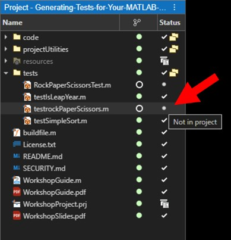

**Right\-click the test files and select "Add to Project"**

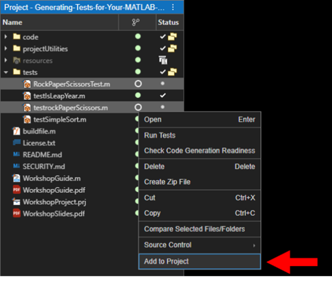

**Confirm your test files have been added to the project by seeing the check mark in the Status column and the "+" icon in the Git column**

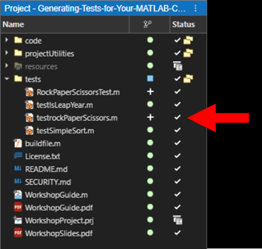

Congratulations! You just created multiple tests for your MATLAB code!

It was easier than you thought, right?

<a id="TMP_0186"></a>

# Part 3:  Finding existing tests, measuring coverage, and catching bugs

In this section, you will:

1. Find existing tests for [`isLeapYear.m`](./code/isLeapYear.m)
2. Enable and explore code coverage
3. Identify missing coverage and a bug
4. Fix the bug
5. Add a test point to an existing test file

<a id="TMP_2630"></a>
**Part 3.1:  Finding existing tests for a code file**

When working with a new codebase or making changes to an existing file, you should run any existing tests that exercise that function to make sure you haven't broken anything.

But this raises several questions:

- Are there are any existing tests?
- Where are the tests?
- Should we just run all the tests?
- How do we know which tests (or if any tests) actually exercise the code we are working on?

In MATLAB R2025a, MATLAB Test introduced a "Find Tests" feature that automatically finds any tests related to the file you are looking at and ignores any tests that are not related to this file.

Let's see how this works using the [`isLeapYear`](./code/isLeapYear.m) function.

**Open** [**`isLeapYear.m`**](./code/isLeapYear.m)

```matlab
edit isLeapYear.m
```

**Press the "Find Tests" button in the Editor toolstrip**

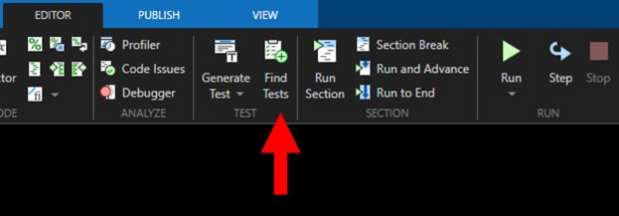

**Select the root of your project to identify all tests in your project that use** **`isLeapYear`**

- *Note:*  This root of your project is the default location, so you can just choose "OK"

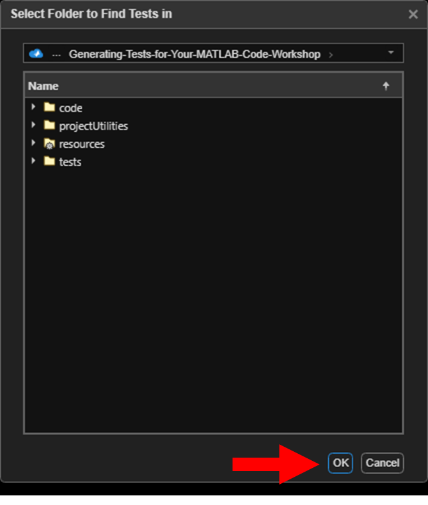

MATLAB automatically will perform a dependency analysis on `isLeapYear`.

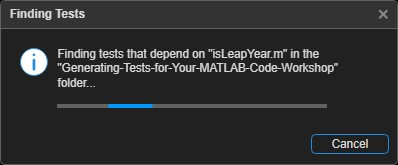

After the dependency analysis, you will see 5 tests that are related to `isLeapYear` open in the MATLAB Test Browser.


**Run the tests in the MATLAB Test Browser using the MATLAB Test Browser's "Run" button**

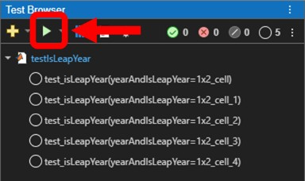

It looks like all the tests passed! Yay!

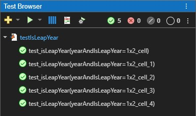

<a id="TMP_7b6c"></a>
**Part 3.2:  Using code coverage to understand how much of your code is being exercised by your tests**

It was great that we already had tests for [`isLeapYear`](./code/isLeapYear.m), but how much of [`isLeapYear`](./code/isLeapYear.m) being exercised by those tests?

"Code coverage" is a way to measure how much and which parts of your code have been exercised by tests.

There are several types of code coverage metrics:

- Statement coverage:  Measure which statements have been executed
- Decision coverage:  Measures whether both `true` and `false` conditions have been exercised for logical branches (e.g., `if`, `switch/case`)
- Condition coverage:  When logical branches are composed of multiple logical conditions (e.g., `x > 5 && x < 10`), this measures whether each logical statement that is part of the `if` statement has been exercised for both `true` and `false` values
- Modified Condition/Decision Coverage (MC/DC):  A modified set of decision + condition coverage metrics that is primarily used in code certification processes

*Note:*  Decision, Condition, and MC/DC metrics require MATLAB Test

The MATLAB Unit Test Framework can automatically measure code coverage, but it is off by default, so let's enable code coverage!

**Open code coverage settings**

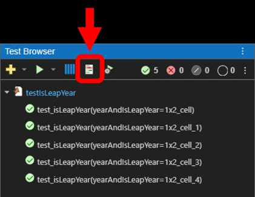

**Enable coverage reporting**

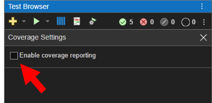

**Select the "Condition" coverage metric**


*Note:*  For this workshop, we will skip MC/DC since it is a significantly more advanced topic and primarily used in certification workflows

**Add the** **`code`** **folder to the "Source" list**

By selecting specific files or folders, we can focus our code coverage measurements on only the files and folders you select and avoid complicating our code coverage reports with code that is less critical for our application.


**Deselect "Open coverage report after run"**

While this option can conveniently open the coverage report after every test run, it can sometimes be distracting when you are rerunning tests frequently.

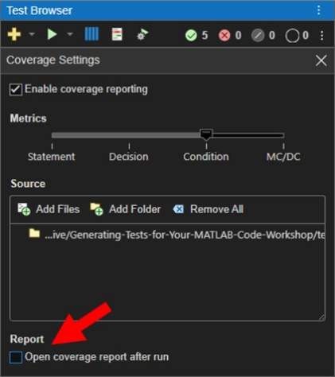

**Close the Coverage Settings**

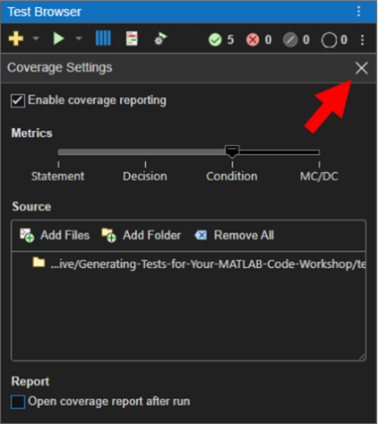

**Rerun your tests**

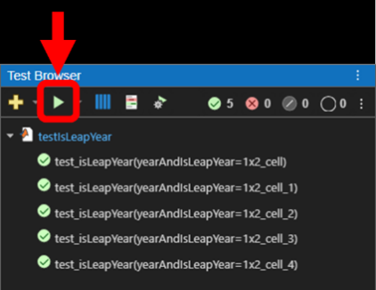

**Click the link in the Command Window to open the code coverage report**

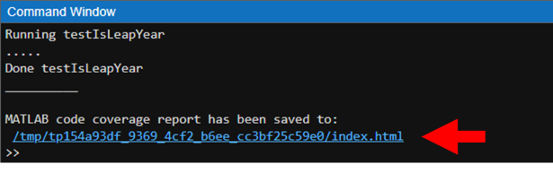

You should see a Code Coverage Report very similar to the one below.

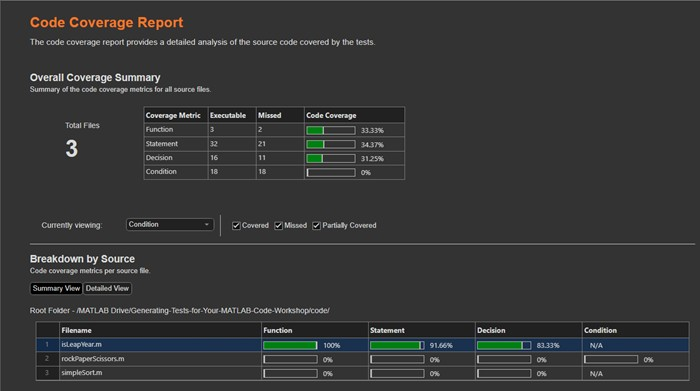

The top of the report gives you an overall summary of the coverage metrics for all of the code in the folders you have chosen, while the "Breakdown by Source" table gives you a breakdown of the coverage metrics by file.

For this workshop, we will focus on the "Breakdown by Source" and the detailed coverage inside the code files.

<a id="TMP_4d1c"></a>
**Part 3.3:  Identifying testing gaps (and potential bugs) for** [**`isLeapYear`**](./code/isLeapYear.m) **using code coverage**

Let's look at the detailed coverage metrics for the [`isLeapYear`](./code/isLeapYear.m) file and and see which parts of the code have been exercised.

**Select the** [**`isLeapYear.m`**](./code/isLeapYear.m) **row in the "Breakdown by Source" table**

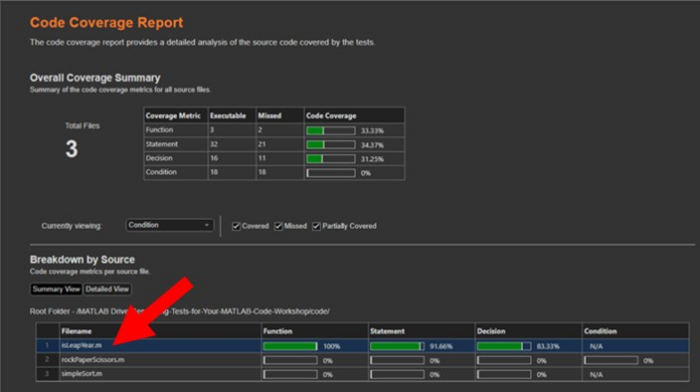

**Scroll down to see the detailed source code and coverage metrics**

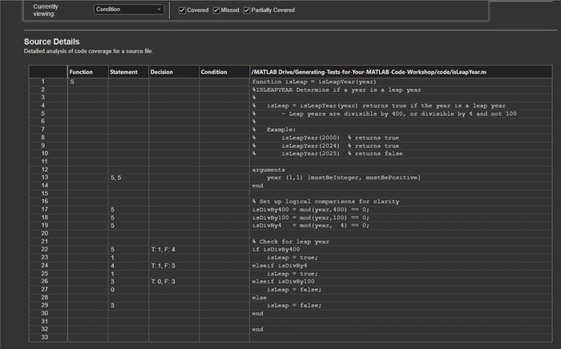

Well, that seems like a rather boring detailed report, right?

The reason you don't really see any interesting data in Source Details is because you are looking at the "Condition" coverage metric, but [`isLeapYear`](./code/isLeapYear.m) is a very simple code with no conditions in its logical branches. You can also see that the "Condition" column is empty, which is another clue for why the source details look empy.

However, you can see that the Statement and Decision columns have data in them, so let's take a look at those coverage metrics.

**Select "Decision" coverage in the "Currently viewing" overlay at the top of the page**

Now the coverage report looks much more interesting!

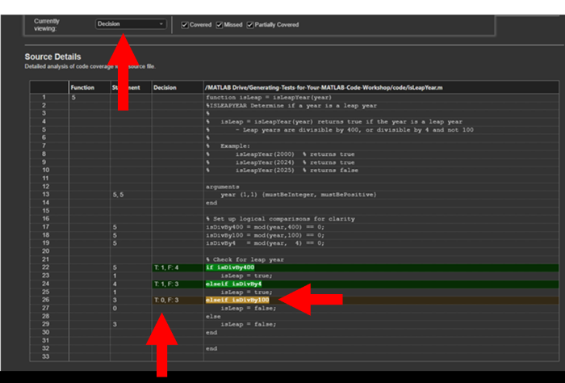

There are several kinds of highlights you can see in the source code:

- Green:  Both `true` and `false` decisions have been exercised
- Yellow:  Only one of the `true` or `false` decisions have been exercised
- Red:  None of the `true` or `false` decisions have been exercised

*Note:*  The coverage report does not have any red because all of the decision branches have been at least partially exercised by at least one test

In addition to the source code highlights, the "Decision" column shows how many times each decision outcome (`true` and `false`) has been exercised by your tests. You can use these numbers to identify which condition outcome you did not exercise or help you decide whether you want to exercise a specific code branch more times.

We can also take a look at the "Statement" coverage metrics to see which statements in our code have and have not been exercised by our tests.

**Select "Statement" coverage in the "Currently viewing" overlay at the top of the page**

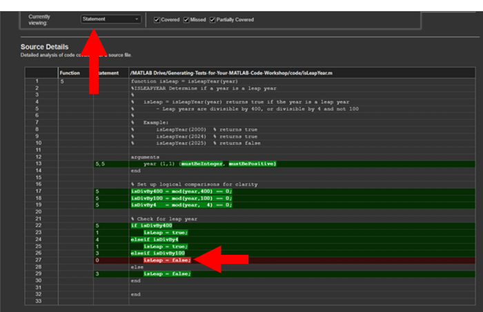

From the highlights, we can see that line 27 of our code has never been exercised by our tests.

Now you can ask the questions:

- Do I just need an extra test to exercise this piece of the code?
- Is this code unreachable (i.e., is it "dead code") and can be removed?
- Or is this a symptom of a bug in our code?

Let's try to find the answers to our questions.

<a id="TMP_7f3b"></a>
**Part 3.4:  Debugging** [**`isLeapYear`**](./code/isLeapYear.m)

Before we dive in, let's take a moment to explain how a leap year is determined.

A year is a leap year when satisfies either of these criteria:

- The year is divisible by 400
- The year is divisible by 4, but it is not divisible by 100

From the Decision coverage above, it looks like we're missing a test case that satisfies the "divisible by 100" part of the logic, so let's try testing the code with a year that is divisible by 100, but not divisible by 400.

Let's use the year 1900, since it is divisible by 100 and not divisible by 400. The result of this test should be `false` because it does not satisfy either of the criteria above.

```
>> isLeapYear(1900)
```
```
ans =
  logical
   1
```

Oh no! We got the wrong answer! It looks like we found a bug in our code!

**Where is the bug?**

When we look at the code flow, we see that the logical branches are being executed in this order:

1. Is the number divisible by 400?
2. Is the number divisible by 4?
3. Is the number divisible by 100?

Ah! There's our problem! We are checking whether the year is divisible by 4 before we check whether the year is divisible by 100. We'll never hit the "divisible by 100" code branch because all years that are divisible by 100 are also divisible by 4.

**Fix the bug and test your changes**

One easy way to fix the code is to switch the order of logical branch \#2 (lines 24\-25) and logical branch \#3 (lines 26\-27).

But...!

With logic branches, it's often useful to consider whether the logic can be written in a simpler, more readable way. One way to do this is to write the logic the same way you would describe it verbally. Earlier in this section, a leap year was defined as "a year that is divisible by 400, or a year divisible by 4 and not divisible by 100."

Using the variables we've already defined in the code, we can rewrite the following code:

```
% Check for leap year
if isDivBy400
    isLeap = true;
elseif isDivBy4
    isLeap = true;
elseif isDivBy100
    isLeap = false;
else
    isLeap = false;
end
```

as:

```
% Check for leap year
if isDivBy400 || (isDivBy4 && ~isDivBy100)
    isLeap = true;
else
    isLeap = false;
end
```

This code is much more readable than the multiple `if/elseif` blocks we had before because:

- the code is simpler to look at
- it makes it clear that there are only 2 possible outcomes:  `true` and `false`
- the `true` case is ultimately broken down into 2 conditions:  `condition1 || condition2`
- the two conditions reflect the verbal explanation of the leap year criteria above
- if neither of the conditions is satisfied, the answer is `false`

**Update the code and run again**

```
>> isLeapYear(1900)
```
```
ans =
  logical
   0
```

It looks like you've fixed the bug! Yay!

**Rerun our tests to see how our code coverage is affected by these changes**

Rerunning our tests and opening the coverage report, we now see that we have interesting data in our "Condition" coverage.

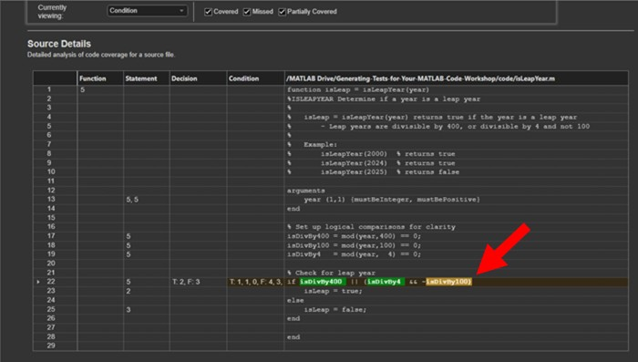

Unfortunately, we still see yellow highlights in the "not divisible by 100" logic. This means that we are missing some part of this coverage.

We can dig a bit deeper into the details of each condition by expanding the results on line 22 using the collapsible triangle to the left of the line numbers.

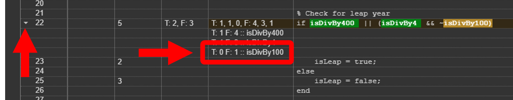

Wait... But didn't you test this with the year 1900?

You did test this case, but you only tested the code interactively at the Command Window. You never added the test point to our automated test suite.

Let's add a new test point so that you never run into this bug again.

**Part 3.5:  Add an additional automated test point for** [**`isLeapYear.m`**](./code/isLeapYear.m)

**Open the test file for** [**`isLeapYear`**](./code/isLeapYear.m) **and add another test point**

Wait... Where is the test file for [`isLeapYear`](./code/isLeapYear.m)? You never actually saw the test file because you found the tests using "Find Tests."

Luckily, the MATLAB Test Browser makes it easy to open the test files related to each test by simply clicking on the test file name. In this case, all of the test points are located in the [`testIsLeapYear.m`](./tests/testIsLeapYear.m) file.

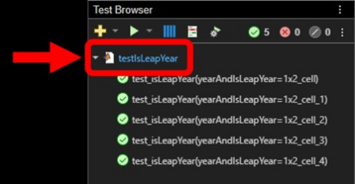

This is what the test file looks like:

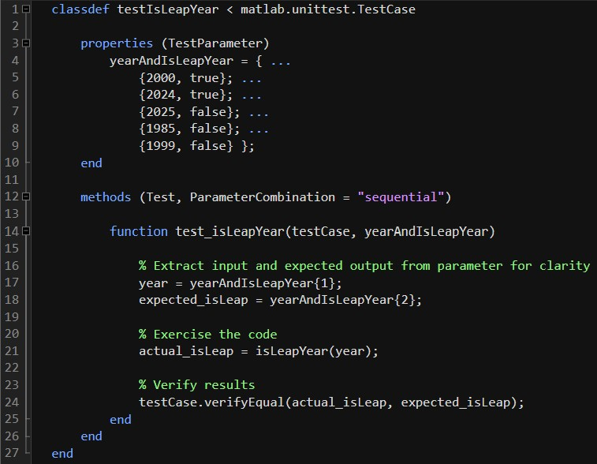

Hm... This seems a bit different than the tests we saw before. The MATLAB Test Browser showed 5 tests, but this test file looks like it only has 1 test in it.

What's going on here?

The answer:  The test in [`testIsLeapYear.m`](./tests/testIsLeapYear.m) is a parameterized test.

**Understanding parameterized tests**

A parametrized test is a kind of test that enables you to reuse a single test function across multiple test points (i.e., across multiple inputs).

Parameterized tests are extremely useful when:

- you need to test a code multiple times with multiple inputs
- the calling syntax is the same across multiple tests
- the verifications are the same across multiple tests

The way a parameterized test works is by defining a test parameter (or multiple test parameters) that contain the inputs you want to pass into your code, and passing that test parameter to your test function.

In this case, the test is using one test parameter that contains both the inputs and expected outputs of the function. The following diagram explains each part of the test parameter definition.

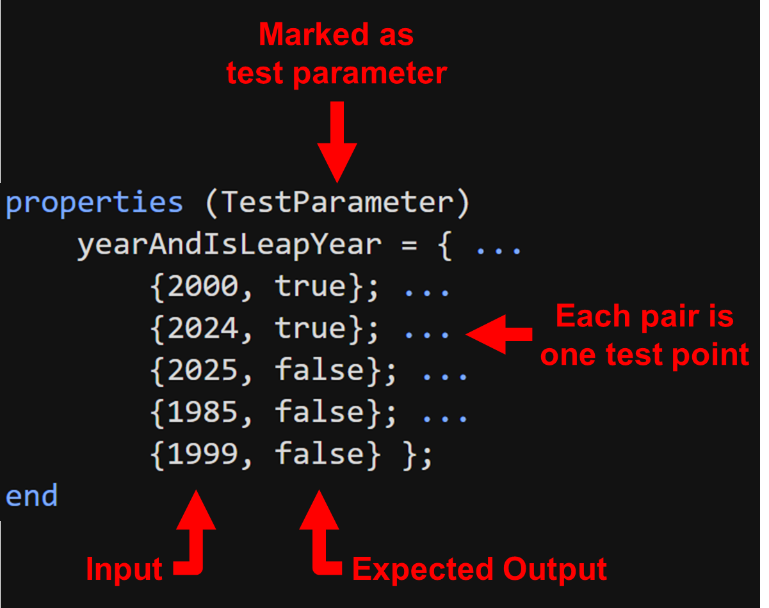

Looking at the test function, you can see it takes this test parameter as an additional input. This test parameter will have a different value every time the function is called.


*Note:*  You can learn more about parameterized testing here:  [https://www.mathworks.com/help/matlab/matlab\_prog/use\-parameters\-in\-class\-based\-tests.html](https://www.mathworks.com/help/matlab/matlab_prog/use-parameters-in-class-based-tests.html)

**Add another test point**

To add another test point, you need to add another input and expected output pair to the `yearAndIsLeapYear` test parameter array.

To do this, you can replace the following code:

```
        yearAndIsLeapYear = { ...
            {2000, true}; ...
            {2024, true}; ...
            {2025, false}; ...
            {1985, false}; ...
            {1999, false} };
```

with:

```
        yearAndIsLeapYear = { ...
            {2000, true}; ...
            {2024, true}; ...
            {2025, false}; ...
            {1985, false}; ...
            {1999, false}; ...
            {1900, false} };
```

You should end up with a test parameter that looks like:

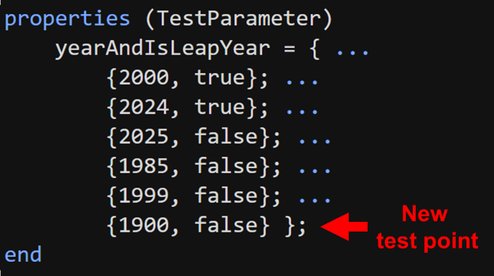

**Rerun your tests and look at the coverage report**

*Note:*  You must use the "Run Tests" button in the Editor toolstrip to to pick up the new test point we added. The "Run" button in the MATLAB Test Browser will only run the tests that are loaded in the panel. It will not automatically pick up new tests in the files.


It looks like we've achieved full condition coverage for [`isLeapYear`](./codeSimple/isLeapYear.m). Yay!

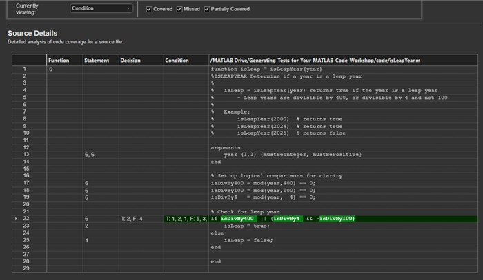

<a id="TMP_043f"></a>

# Part 4:  Updating badges, committing our changes, and pushing to GitHub

In this section, you will:

1. Update the repository badges in [`README.md`](./README.md)
2. Commit our changes to source control
3. Generate a GitHub Personal Access Token
4. Push our changes to GitHub

<a id="TMP_4476"></a>
**Part 4.1:  Update repository badges**


Repository badges are great ways to showcase and allow exploration of the quality of your code. Badges are defined in a repository's [`README.md`](./README.md).

One unfortunate aspect of badges is that they are always hardcoded to a specific repository's URL. Since you forked these badges from another repository, you will need to update the badge so they point to your repository instead.

To make this easy, the workshop provides a useful project shortcut that will automatically update the links in your [`README.md`](./README.md) file.

**Update the badges by single\-clicking the "Update README Link" item in the "Shortcuts" section of the Project toolstri**p

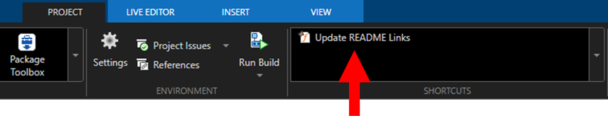

*Note*: If you want to manually update the links, you will need to make the following changes to all of the links in the [`README.md`](./README.md) file:

- replace the "mathworks" GitHub username with your GitHub username
- if you renamed the repository during the fork process in [Part 1.1](#H_DB2C80D4), replace "Generating\-Tests\-for\-Your\-MATLAB\-Code\-Workshop" repository name with your GitHub repository name

Your badges will now but up\-to\-date and point to your personal repository once you commit and push your changes.

<a id="TMP_917f"></a>
**Part 4.2:  Commit our changes to source control**

Now that you've fixed a bug, added tests and test points, and updated your badges, it's time to commit your changes!

**In the "Project" toolstrip, press "Commit"**

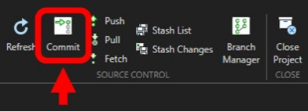

**Type in a useful commit message and press "Commit"**

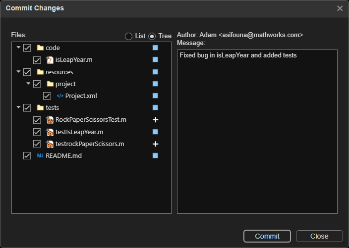

You have now committed your changes.

Usually, the next step is to push our changes back to GitHub. This is really easy and straightforward when using Git from a desktop application (e.g., the desktop version of MATLAB). However, since we are pushing our changes from an online application (MATLAB Online), GitHub requires a personal access token to allow MATLAB Online to make changes to your GitHub repository.

<a id="TMP_5ea8"></a>
**Part 4.3:  Generating a GitHub Personal Access token to enable MATLAB Online to push our changes to our GitHub repository**

 

Over the last few years, GitHub has increased its focus on security. One of the major user\-facing ways GitHub is enforcing some of these better security practices is by [moving away from the use of passwords](https://github.blog/2020-07-30-token-authentication-requirements-for-api-and-git-operations/), and recommending that people use personal access tokens instead.

<a id="H_CBDCBEA6"></a>
Personal access tokens are meant to be treated like passwords:

- They are supposed to be difficult or impossible to memorize or guess
- They are not meant to be written down
- They are not meant to be shared with others

When you install Git on your desktop, it comes with the Git Credential Manager. The Git Credential Manager will accept a username/password combination, it will securely get and store a personal access token for you, and it will make it very easy to push and pull changes without manually generating a personal access token.

For this MATLAB Online session, you will need to manually create a personal access token to give MATLAB Online permission to push changes to your GitHub repository. GitHub provides directions for [how to create a personal access token](https://docs.github.com/en/authentication/keeping-your-account-and-data-secure/creating-a-personal-access-token), but this part of the workshop will give you a step\-by\-step guide to creating your own personal access token.

<a id="H_7AE18FA9"></a>
**On GitHub, press your profile picture (top right of the page) and select "Settings"**

 

**Select "Developer settings" at the bottom of the left\-hand navigation menu**

 

**Select "Personal access tokens > Fine\-grained tokens"**

 

<a id="H_B96DECF2"></a>
**Press "Generate new token"**


***Note:***  You may need to log into GitHub again to complete this action.

<a id="H_8CAA78FC"></a>
**Name your token**


**Limit token access to only the workshop repo**


**Select "Add Permissions > Contents" to enable pushing changes to your repository**


**Change "Contents" access permissions to "Read and write"**


<a id="H_2C284494"></a>
**Press "Generate token"**


**Confirm the creation of the token**


**Copy your personal access token to your clipboard**

***WARNING:***

- You only have 1 chance to copy the personal access token, so do not navigate away from the page until you have used the token wherever you need it
- If you forget to copy your token string or you need to give another service access to your repository at a later time, you will need to create a new token

Any service that generates access token strings will only allow you to see or copy the token string the moment the token is created. As soon as you refresh the page or navigate away, the token string will be hidden forever. This protects you from having your token stolen or copied if someone breaks into your account.


Your personal access token should start with "`github_pat_`" followed by many alphanumeric characters.

<a id="TMP_4b5c"></a>
**Part 4.4:  Pushing your changes to GitHub**

Now let's push your changes to GitHub!

**In the Projects tab, press the "Push" button**

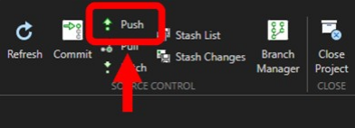

<a id="H_D0E7BA3D"></a>
**Enter your username and paste your personal access token into the MATLAB Online Git dialog and press "OK"**


At this point, all of your changes will be pushed to GitHub.

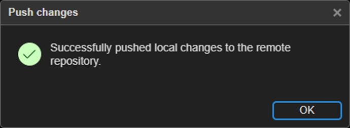

You should now be able to see your latest changes directly in our GitHub repository.

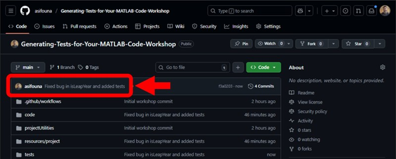

<a id="TMP_0688"></a>

# Part 5:  Watch GitHub Actions automatically test your changes and publish results

In this section, you will:

1. Explore GitHub Actions as it automatically tests your changes and publishes test results
2. View your published test and code coverage results

<a id="TMP_2df5"></a>
**Part 5.1:  Watch GitHub Actions automatically test your code and publish our results**

Once you push your changes back to Git, GitHub Actions will automatically test your code and publish your test results.

To make this possible, the workshop provides you a pre\-written [GitHub Actions YAML file](..github/workflows/ci.yml) that tells GitHub Actions how to get MATLAB and what to do with your code as soon as changes are pushed.

- You can learn more about GitHub Actions YAML files here:  [https://docs.github.com/en/actions/reference/workflows\-and\-actions/workflow\-syntax](https://docs.github.com/en/actions/reference/workflows-and-actions/workflow-syntax)

*Notes:*

- We are using the MATLAB build tool to automate some of the build actions, but all of these actions can be accomplished with simple MATLAB code, as well.
- You can learn more about the MATLAB build tool here:  [https://www.mathworks.com/help/matlab/matlab\_prog/overview\-of\-matlab\-build\-tool.html](https://www.mathworks.com/help/matlab/matlab_prog/overview-of-matlab-build-tool.html)

**Select the "Actions" tab to see your build in action**


Here you'll see all the builds that are running or have been run in the past.

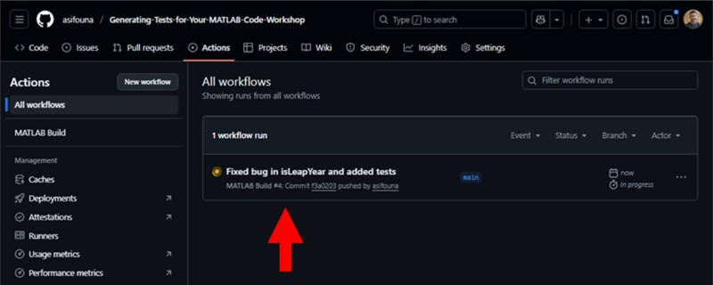

<a id="H_FBE3C756"></a>
**Dive deeper by selecting the listed workflow item**

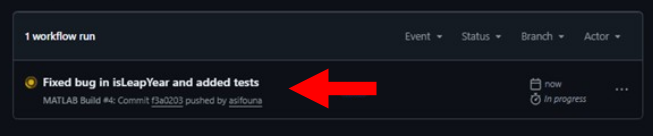

**Select the "build" box**


**Observe the GitHub Actions log as your build is running**

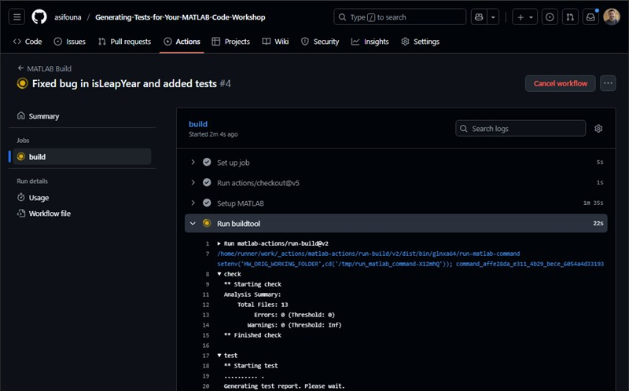

The icon next to the build reflects the result of the build. A green check mark means the build ran successfully.

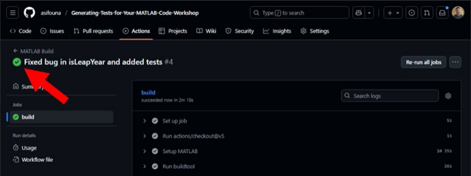

Another place you can see an indication of your passing build is on your repository home page.

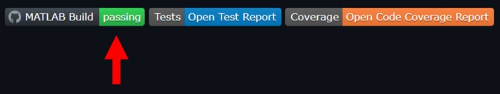

*Note:*  You may need to refresh your browser a few times or use "Shift+F5" for the status to update

You now have a repository that will automatically test your code every time you push any changes!

<a id="TMP_99e6"></a>
**Part 5.2:  Viewing your test and coverage results directly in GitHub**

Once your build completes, anyone that can see your repository will be able to explore your published test and code coverage results.

The badges on your repository's home page offer an easy way to:

- See whether your last build passed or failed
- Open the published test report
- Open the published code coverage report

*Note:*  Badge links will navigate your current browser tab to the link destination, so you will need to navigate back to the main repository page to select a different badge or report

<a id="H_C2E2595D"></a>
**View your test report by selecting the "Open Test Report" badge**


The test report looks like this:

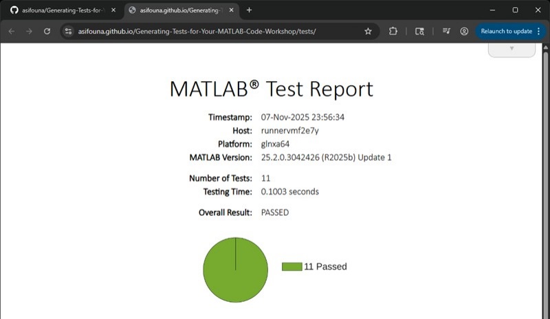

<a id="H_C2E2595D"></a>
**View your code coverage report by selecting the "Open Code COverage Report" badge**

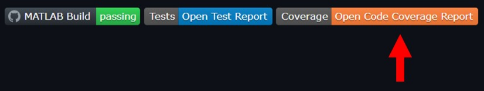

The code coverage report looks like this:

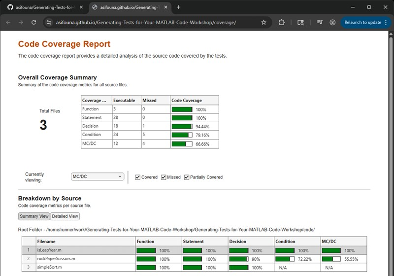

Now anyone that visits your repository can immediately see the quality of your code, explore your test and code coverage results, and will have more confidence in the code you are writing!

<a id="TMP_7711"></a>

# Workshop wrap\-up and additional information

Congratulations! You've completed the "Generating Tests for Your MATLAB Code" Workshop!

**During this workshop, you have successfully:**

- generated tests using your command history and MATLAB Copilot
- automatically found and ran existing tests
- explored code coverage metrics for your tested code
- identified bugs based on your testing and code coverage
- automated your testing using GitHub Actions
- published your test and code coverage results to GitHub Pages

We hope this workshop has shown you the value of software testing, how approachable software testing is with MATLAB and MATLAB Test, and how to automate testing using continuous integration (CI) practices.

**Check out these links for more information about features we discussed and additional features that may help as you test your code:**

- Software testing video series:  [https://www.mathworks.com/videos/series/software\-testing.html](https://www.mathworks.com/videos/series/software-testing.html)
- Generating tests with MATLAB Test:  [https://www.mathworks.com/help/matlab\-test/ug/generate\-tests\-for\-matlab\-source\-code.html](https://www.mathworks.com/help/matlab-test/ug/generate-tests-for-matlab-source-code.html)
- Generating equivalence tests for automated C/C++ code generation:  [https://www.mathworks.com/help/matlab\-test/ug/generate\-c\-code\-and\-test\-for\-equivalence.html](https://www.mathworks.com/help/matlab-test/ug/generate-c-code-and-test-for-equivalence.html)
- Parameterized testing:  [https://www.mathworks.com/help/matlab/matlab\_prog/use\-parameters\-in\-class\-based\-tests.html](https://www.mathworks.com/help/matlab/matlab_prog/use-parameters-in-class-based-tests.html)
- Property\-based testing:  [https://en.wikipedia.org/wiki/Software\_testing\#Property\_testing](<https://en.wikipedia.org/wiki/Software_testing#Property_testing>)
- Finding existing tests using "Find Tests":  [https://www.mathworks.com/help/matlab\-test/ug/find\-tests\-that\-depend\-on\-files.html](https://www.mathworks.com/help/matlab-test/ug/find-tests-that-depend-on-files.html)
- MATLAB Test Browser:  [https://www.mathworks.com/help/matlab/ref/testbrowser\-app.html](https://www.mathworks.com/help/matlab/ref/testbrowser-app.html)
- Code coverage:  [https://www.mathworks.com/help/matlab\-test/ug/collect\-code\-coverage\-metrics\-for\-matlab\-source\-code.html](https://www.mathworks.com/help/matlab-test/ug/collect-code-coverage-metrics-for-matlab-source-code.html)
- CI Configuration Examples repository and badge examples:  [https://github.com/mathworks/ci\-configuration\-examples](https://github.com/mathworks/ci-configuration-examples)
- Creating a MATLAB docker container for CI:  [https://github.com/mathworks\-ref\-arch/matlab\-dockerfile/tree/main/alternates/non\-interactive](https://github.com/mathworks-ref-arch/matlab-dockerfile/tree/main/alternates/non-interactive)
- MATLAB build tool overview:  [https://www.mathworks.com/help/matlab/matlab\_prog/overview\-of\-matlab\-build\-tool.html](https://www.mathworks.com/help/matlab/matlab_prog/overview-of-matlab-build-tool.html)
- MATLAB build tool introduction blog post:  [https://blogs.mathworks.com/developer/2022/10/17/building\-blocks\-with\-buildtool](https://blogs.mathworks.com/developer/2022/10/17/building-blocks-with-buildtool/)
- Faster testing with MATLAB build tool blog post:  [https://blogs.mathworks.com/developer/2025/07/02/test\-impact\-analysis\-intro](https://blogs.mathworks.com/developer/2025/07/02/test-impact-analysis-intro)
- Developer Zone blog:  [https://blogs.mathworks.com/developer](https://blogs.mathworks.com/developer/)
- CI licensing for private repositories:  [https://www.mathworks.com/support/batch\-tokens.html](https://www.mathworks.com/support/batch-tokens.html)

<a id="TMP_536c"></a>

# Homework:  Hands\-on experience with property\-based testing

Everything you've done until now is considered "example\-based testing." This is the practice of passing a specific input to a function and comparing its results to a specific expected output. For every specific input, you will need a specific output to compare it against.

Another way to test a code is by identifying "properties" (i.e., characteristics) of the results it produces that stay the same no matter what the input is. Once these properties are identified, you can write tests that check these properties against many different test inputs. Being able to run tests against many different inputs (even randomly generated inputs) can sometimes help you discover bugs and edge cases that you might have missed with a smaller sample of test inputs.

Let's explore this concept with an example.

The workshop contains a function named [`simpleSort`](./code/simpleSort.m) that sorts an input using a simple bubble sorting algorithm. This function:

- sorts an input in an ascending order
- does not remove duplicates

You can think of the "properties" of the result like this:

- Since the function sorts numbers in an ascending order, the change from one element to the next must be greater than or equal to zero
- Since the function does not remove duplicate numbers, the result must have the same number of elements as the input

To get you started, the workshop provides a test named [`testSimpleSort`](./tests/testSimpleSort.m) with both:

- a single example\-based test
- a commented out property\-based test that will be tested against many inputs without any expected outputs

**Your homework:**

- Uncomment the property\-based test in [`testSimpleSort`](./tests/testSimpleSort.m)
- Add code to the `checkIsSortedAscending` local function at the bottom of the file to check whether the result is sorted in ascending order
- Find an existing test verification method to check whether the result has the same number of elements as the input

Copyright 2025 The MathWorks, Inc.